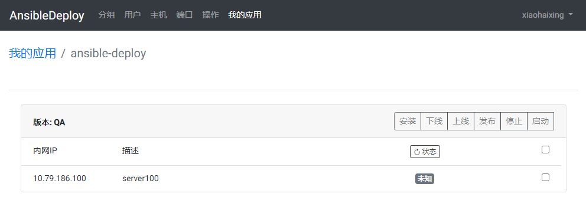

## Ansible Deploy 


### 一、简介

基于Ansible的简明部署工具，简化部署过程，减少不必要的手工操作引起的失误，可以有效加快开发节奏。
支持自定义Ansible部署脚本，以适应自己团队的习惯与流程，也可以用做运维团队自定义日常的维护操作。
内置了简单的分组、用户权限、主机与端口的管理功能，减少不必要的资源滥用与端口冲突。

开发语言与框架：前端为Angular11/Bootstrap4，后端为Java+Spring+Akka，数据库为MySQL。

其实这个项目开始就是为了比较系统的学一遍Angular，部署功能部分做得比较简单，大部分开发都是在写界面，
写着写着干脆就把功能都写完整了。对于一个老后端，之前用Angular写前端，因为没有系统学习过，一直感觉很笨拙，
不能随心所欲，所以就起了个项目过一遍Angular文档，目前的学习效果还是比较满意的，能比较顺利的做出简单的后台应用了。

### 二、功能与界面预览

  - 发布脚本执行界面
  
   

  - 主页面(我的应用)
  
   
   
  - 应用查看
  
   
   
  - 自定义应用类型
  
    内置了三个完整的示例（Ansible2.2）
  
   
   
   
   
   
  - 定制应用placebook脚本
  
   
  
  - 端口管理与分配
  
   
  
  - 部署目标主机管理
  
   
   
  - 用户与权限管理
  
   
   
   
   
### 三、Ansible Deploy系统安装

Ansible Deploy的安装很简单，因为是Java开发所以基本就是配置JDK与Tomcat就好了。

##### 1、创建deploy用户用于系统运行

##### 2、安装JDK1.8.xxx，配置PATH与JAVA_HOME

##### 3、安装Tomcat8到$HOME/tomcat

##### 4、将[ansible-deploy-0.9.zip](https://download.csdn.net/download/arksea/13206097)安装包解压到以下目录

```text
$HOME/tomcat/webapps/aop-web-server/
```

如需自己编译需要注意一下，依赖的另一个工具项目要先配置到本地或代码库里：

    

##### 5、配置$HOME/tomcat/conf/server.xml，如果是新的版本需要自己调整一下

```xml
<?xml version='1.0' encoding='utf-8'?>
<Server port="8261" shutdown="SHUTDOWN">
  <Listener className="org.apache.catalina.startup.VersionLoggerListener" />
  <Listener className="org.apache.catalina.core.AprLifecycleListener" SSLEngine="on" />
  <Listener className="org.apache.catalina.core.JreMemoryLeakPreventionListener" />
  <Listener className="org.apache.catalina.mbeans.GlobalResourcesLifecycleListener" />
  <Listener className="org.apache.catalina.core.ThreadLocalLeakPreventionListener" />
  <GlobalNamingResources>
    <Resource name="UserDatabase" auth="Container"
              type="org.apache.catalina.UserDatabase"
              description="User database that can be updated and saved"
              factory="org.apache.catalina.users.MemoryUserDatabaseFactory"
              pathname="conf/tomcat-users.xml" />
  </GlobalNamingResources>
  <Service name="Catalina">
    <Connector port="8062" protocol="HTTP/1.1" connectionTimeout="20000"  redirectPort="8462" />
    <Connector port="8661" protocol="AJP/1.3" redirectPort="8462" />
    <Engine name="Catalina" defaultHost="localhost">
      <Realm className="org.apache.catalina.realm.LockOutRealm">
        <Realm className="org.apache.catalina.realm.UserDatabaseRealm" resourceName="UserDatabase"/>
      </Realm>
      <Host name="localhost"  appBase="webapps/ansible-deploy" unpackWARs="false" autoDeploy="false">
        <Context path="" docBase=""  reloadable="true" caseSensitive="false" debug="0"></Context>
      </Host>
    </Engine>
  </Service>
</Server>
```

##### 6、修改系统配置，主要是数据库连接配置

配置文件位置：$HOME/tomcat/webapps/aop-web-server/WEB-INF/classes/application.properties
```properties

jdbc.driver=com.mysql.jdbc.Driver
jdbc.url=jdbc:mysql://127.0.0.1:3306/deployserver?autoReconnect=true&failOverReadOnly=false&useUnicode=true&characterEncoding=utf-8
jdbc.username=deploy
jdbc.password=123456

shiro.cipherKey=4AvVhmFLUs0KTA3Kprsdag==
heartBeat.setStatusKey=123456

```
除了需要配置MySQL数据库连接的用户名密码，需要说明的做是两个

###### 1)、shiro.cipherKey 系统登录的秘钥

秘钥为16字节128位随机数的Base64编码，以下是生成代码：

```groovy
  SecureRandom secureRandom = SecureRandom.getInstance("SHA1PRNG");
  byte[] bytes = new byte[16];
  secureRandom.nextBytes(bytes);
  System.out.println((org.apache.shiro.codec.Base64.encodeToString(bytes)));
```

###### 2)、heartBeat.setStatusKey

用于调用HTTP心跳API接口设置系统上下线的秘钥，没有格式要求，调用方法如下

    url: http://localhost:{{http_port}}/heartbeat
    method: PUT
    body: "OFFLINE;123456"


##### 7、系统运行后需要先注册admin用户，系统会默认为admin用户分配系统管理角色，注册后可能需要刷新页面。


### 四、附带的部署脚本例子

#### 1、首先简单说明一下例子脚本使用的部署方式：

 - 程序员或CI系统将编译好的部署资源上传到部署SVN库
 - 部署服务在主控服务器执行Ansible脚本
 - 脚本用SSH无密码登录到部署目标主机
 - 脚本从SVN库下载目标服务需要的资源，生成文件，配置环境，然后启动相关进程。
 
 附: 项目的build.gralde中的辅助脚本可以把编译好的代码发布到SVN
 
```groovy
task publishToSvnOnline(type: Exec) {
    dependsOn publishOnline
    commandLine 'cmd', '/c', 'TortoiseProc.exe /command:commit /path:"./publish/online"'
}

```

#### 2、安装Ansible

将Ansible安装到$HOME/ansible

Ansible的具体安装步骤可以直接看官网的文档，就简单的几步。

虽然起了个Ansible Deploy的名字，实际上系统加了脚本配置的功能后，实际上并不一定要基于Ansible，也不一定用于Deploy，
任何可以执行的脚本都可以执行，比如Groovy、Python等，所以需要什么脚本就安装什么环境吧。因为内置的部署脚本实例是基于Ansible，所以需要安装Ansible。

#### 3、配置部署主控服务器对目标主机的SSH无密码登录

##### 1）创建用op用于对目标主机SSH登录与操作

在主控服务器及所有目标主机上创建op用户


```shell
#adduser op //添加一个名为op的用户
#passwd op //修改密码
```

##### 2) 授予op用户root权限

修改 /etc/sudoers 文件，找到root一行，在root下面添加一行，如下所示：

```text
## Allow root to run any commands anywhere
root ALL=(ALL) ALL
op ALL=(ALL) NOPASSWD:ALL
```

##### 3) 用刚才创建的op用户登录主库服务器生成秘钥

用ssh-key-gen 在主控服务器上创建公钥和密钥

```shell
#ssh-keygen -t rsa
```

此时会在/home/op/.ssh目录下生成密钥对

```
[op@deploy-server ~]$ ls -la .ssh
总用量 16
drwx------   2   op op 4096 8月 24 09:22 .
drwxrwx--- 12  op op 4096 8月 24 09:22 .
.-rw-------   1   op op 1675 8月 24 09:22 id_rsa
-rw-r--r--    1   op op 399 8月 24 09:22 id_rsa.pub
```

注意调整.ssh目录与秘钥文件的权限

##### 4) 把公钥复制到部署目标主机

```
[op@deploy-server ~]$ ssh-copy-id op@10.124.84.20
```

这个时候op的公钥文件内容会追加写入到目标主机op用户的 .ssh/authorized_keys 文件中

**注意，.ssh目录的权限为700，其下文件authorized_keys和私钥的权限为600。
否则会因为权限问题导致无法免密码登录。我们可以看到登陆后会有known_hosts文件生成。**

##### 5) 添加配置文件“~/.ssh/config”，加上以下两行，SSH登陆时会忽略known_hosts的访问。

```text
StrictHostKeyChecking no
UserKnownHostsFile /dev/null
```

##### 6）免密登录配置好后未生效排查

###### A、SELinux权限问题
查看SELinux是否开启: `/usr/sbin/sestatus -v` 或 `systemctl status firewalld`
- 解决方法1
  关闭SELinux: `systemctl stop firewalld`
  开机禁用SELinux: `systemctl disable firewalld`

- 解决方法2
执行 restorecon -r -vv /root/.ssh 命令配置权限

###### B、用户目录权限过大，chmod 700 /home/user 限制权限
###### C、检查authorized_keys文件权限，并设置为700
###### D、删除/root/.ssh/known_hosts文件
###### E、重启sshservice sshd restart
###### F、检查/etc/ssh/sshd_config文件
 - 将`#StrictModes yes`设置为`StrictModes no`
 - 将`#AuthorizedKeysFile .ssh/authorized_keys` 设置为 `AuthorizedKeysFile .ssh/authorized_keys`

#### 4、安装SVN

##### 1) 安装

例子的部署资源库根目录：/data/javasvn

```text
#yum install subversion
#svnserve -d -r /data/javasvn/ --listen-port 8000
```

##### 2) 权限

为deploy用户配置SVN权限

###### /data/javasvn/authz

```text
[aliases]

[groups]

[/]
deploy = rw

```

###### /data/javasvn/passwd

```text
[users]
deploy = 123456
```

#### 5、Tomcat应用部署实例

例子脚本已经配置在系统里了，这里列部分例子，这些操作是基于Ansible2.2编写的，如果用新版本一些细节可能需要调整

##### 1) 安装

```text
- hosts: deploy_target
  remote_user: op
  vars_files:
    - vars.yml
  tasks:
    - name: 添加用户组"tomcat"
      group: name=tomcat
      become: yes

    - name: 添加应用运行用户"{{ apptag }}"
      user: name={{apptag}} group=tomcat createhome=yes
      become: yes

    - name: 判断JDK目录是否已存在
      stat: path=/opt/jdk1.8.0_66
      register: jdkDir

    - name: 下载JDK
      subversion: repo=svn://10.79.186.29:8000/download/jdk/jdk-8u66-linux-x64.tar.gz dest=/opt/jdk-8u66-linux-x64.tar.gz force=yes export=yes username=deploy password=unicorn4Felink
      become: yes
      when: jdkDir.stat.exists == false

    - name: 解压JDK安装包
      unarchive: src=/opt/jdk-8u66-linux-x64.tar.gz dest=/opt copy=no
      become: yes
      when: jdkDir.stat.exists == false

    - name: 修改JDK目录owner与group
      file: path=/opt//opt/jdk1.8.0_66 owner=root group=root state=directory recurse=yes
      become: yes
      when: jdkDir.stat.exists == false

    - name: 判断Tomcat目录是否已存在
      stat: path=/home/{{apptag}}/tomcat-8.0.30
      register: tomcatDir
      become: yes
      become_user: "{{apptag}}"

    - name: 从SVN下载Tomcat8
      subversion: repo=svn://10.79.186.29:8000/download/tomcat/tomcat8 dest=/home/{{apptag}}/tomcat-8.0.30 force=no export=yes username=deploy password=unicorn4Felink
      notify: restart tomcat
      become: yes
      become_user: "{{apptag}}"
      when: tomcatDir.stat.exists == false

    - name: 为Tomcat目录创建软连接
      file: src=/home/{{apptag}}/tomcat-8.0.30 path=/home/{{apptag}}/tomcat state=link
      become: yes
      become_user: "{{apptag}}"
      when: tomcatDir.stat.exists == false

    - name: 使用模版配置Tomcat服务器
      template: src=server.xml dest=/home/{{apptag}}/tomcat/conf/
      become: yes
      become_user: "{{apptag}}"

    - name: 配置Tomcat环境变量
      template: src=setenv.sh dest=/home/{{apptag}}/tomcat/bin/setenv.sh mode=0644 owner={{apptag}} group=tomcat
      become: yes

    - name: 配置 jmx 访问权限
      template: src=jmx.access dest=/home/{{apptag}}/tomcat/bin/ mode=0400 owner={{apptag}} group=tomcat
      become: yes

    - name: 配置 jmx 账号密码
      template: src=jmx.password dest=/home/{{apptag}}/tomcat/bin/ mode=0400 owner={{apptag}} group=tomcat
      become: yes

    - name: 安装系统服务
      template: src=tomcat-initscript.sh dest=/etc/init.d/tomcat-{{apptag}} mode=0755
      become: yes

- hosts: svnhost
  remote_user: op
  vars_files:
    - vars.yml
  tasks:
    - name: 确认SVN库是否已创建
      stat: path=/data/javasvn/{{apptag}}
      register: rep
      become: true

    - name: 初始化SVN库目录 
      command: chdir=/data/javasvn svnadmin create {{apptag}}
      when: rep.stat.exists == False
      become: true

    - name: 配置SVN库
      copy: src=svnserve.conf dest=/data/javasvn/{{apptag}}/conf mode=644
      become: true

```

##### 2) 发布

```text
- hosts: deploy_target 
  remote_user: op
  vars_files:
    - vars.yml
  tasks:

    - name: 测试服务是否运行
      shell: ps ax | grep /home/{{apptag}}/tomcat | grep java | grep -v grep | awk '{print $1}'
      become: yes
      register: running

    - name: 将服务置为离线状态
      uri:
        url: http://localhost:{{http_port}}/heartbeat
        method: PUT
        body: "OFFLINE;123456"
      when: running.stdout!=''

    - name: 确认服务已在离线状态
      uri: 
          url: http://localhost:{{http_port}}/heartbeat
          return_content: true
      become: yes
      register: heartbeat
      failed_when: "'OFFLINE' not in heartbeat.content"
      when: running.stdout!=''

    - debug:
        msg: "@@SET_HOST_STATUS {{inventory_hostname}},离线,offline,状态,"
      when: running.stdout!='' and "'OFFLINE' in heartbeat.content"

    - name: 延迟10秒
      wait_for: 'timeout=10'
      delegate_to: localhost
      when: running.stdout!=''

    - name: 停止Tomcat服务
      service: name=tomcat-{{apptag}} state=stopped
      become: yes

    - name: 确认服务端口已关闭
      wait_for: 'port={{http_port}} state=stopped timeout=30'

    - debug:
        msg: "@@SET_HOST_STATUS {{inventory_hostname}},已停止,stopped,状态,"

    - name: 等待10秒
      wait_for: 'timeout=10'
      delegate_to: localhost
      when: running.stdout!=''

    - name: 删除旧部署文件
      file: path=/home/{{apptag}}/tomcat/webapps/{{apptag}} state=absent
      become: yes

    - name: 从资源库下载部署文件
      subversion: repo=svn://10.79.186.29:8000/{{apptag}}/{{repository}} dest=/home/{{apptag}}/tomcat/webapps/{{apptag}} force=no username=deploy password=unicorn4Felink revision={{revision}}
      become: yes
      become_user: "{{apptag}}"

    - name: 启动Tomcat服务
      service: name=tomcat-{{apptag}} state=started
      become: yes

    - name: 等待服务启动
      wait_for: 'port={{http_port}} state=started timeout=30'

    - debug:
        msg: "@@SET_HOST_STATUS {{inventory_hostname}},运行中,running,状态,"

    - name: 等待10秒
      wait_for: 'timeout=10'
      delegate_to: localhost

    - name: 状态测试
      uri: 
          url: http://localhost:{{http_port}}/heartbeat
          return_content: true
      become: yes
      register: status

    - name: 设置离线状态
      debug:
        msg: "@@SET_HOST_STATUS {{inventory_hostname}},离线,offline,状态,"
      when: "'OFFLINE' in status.content"

    - name: 设置在线状态
      debug:
        msg: "@@SET_HOST_STATUS {{inventory_hostname}},在线,online,状态,"
      when: "'ONLINE' in status.content"

```


### 五、脚本中可以引用的变量

#### 1、系统定义的可以使用的属性

##### 1)、apptag
应用标志，应用的属性，可以认为是应用名，脚本部署时也会使用这个名字创建应用运行的用户
##### 2)、repository
部署代码库分支的相对路径，版本的属性，例如trunk、branches/qa等
##### 3)、revision
分支的版本号，版本的属性，默认是HEAD，必要时可以使用具体的版本号
##### 4)、exec_opt
服务运行的参数，版本的属性

#### 2、应用类型自定义的变量，本例中Tomcat类型的应用，我定义了以下几个变量，都是端口变量，用于自动分配端口

##### 1)、http_port
##### 2)、https_port
##### 3)、ajp_port
##### 4)、jmx_port
##### 5)、server_port


#### 3、主机状态指令

 

操作回显的结果中包含了可以控制主机状态显示的指令，其格式为：
```text
@@SET_HOST_STATUS {{inventory_hostname}},[status_desc],[status_value],[operation_name],
```

##### 1)、inventory_hostname 主机地址，指定修改哪个主机的状态；这是个Ansible变量，表示当前正在操作的目标主机
##### 2)、status_desc 显示的状态文字
##### 3)、status_value 状态的值，系统根据这个值决定状态的颜色，online为绿色，offline为红色，running为青色，stopped为灰色。
##### 4)、operation_name 操作的名字，因为设计上没有限制STATUS类型操作的个数（比如可以把在线状态和进程运行状态分开来），所以这里需要制定要修改哪个STATUS操作的显示
